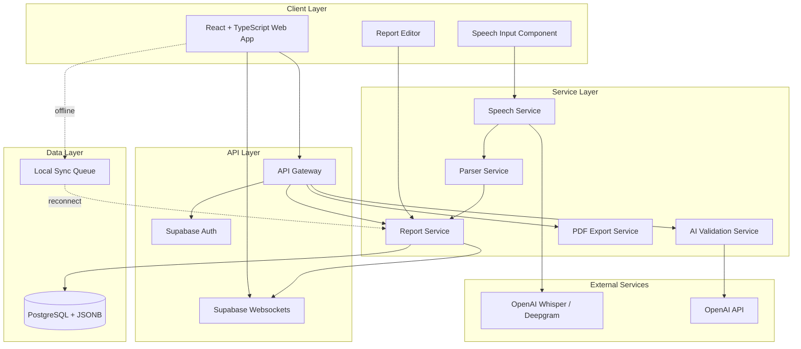
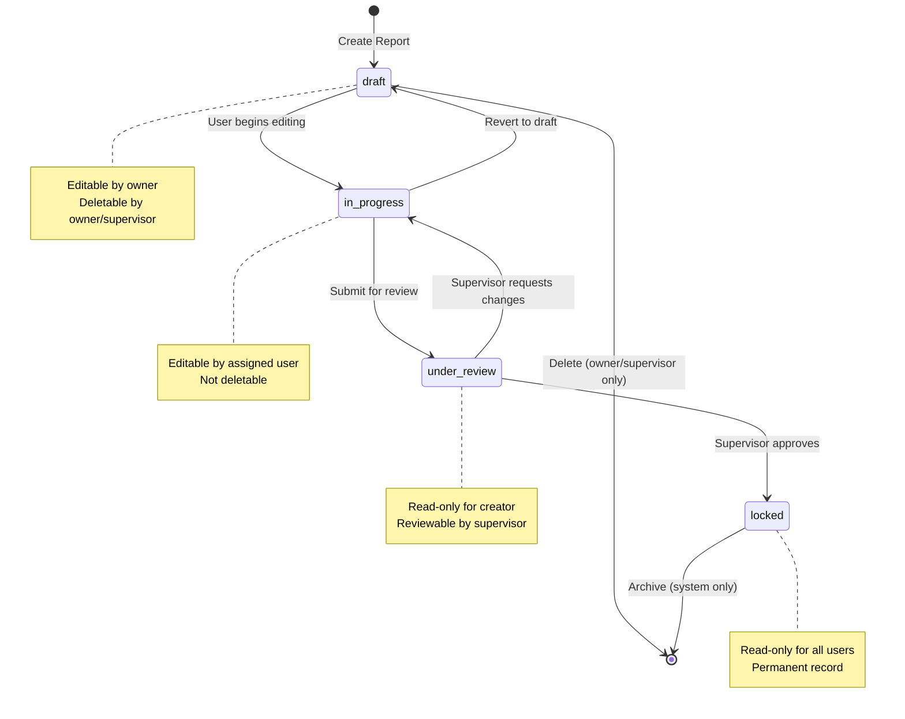

# Design Document: Medical Responder Paperwork System

## Overview

The Medical Responder Paperwork System is a real-time collaborative documentation platform designed for emergency response environments. The system enables police officers, dispatchers, paramedics, nurses, and doctors to create, edit, and finalize incident reports and medical charts using speech-to-text technology and AI-assisted validation.

### Core Design Principles

1. **Real-time First**: All changes propagate to authorized users within 500ms using Supabase websockets
2. **Offline Resilience**: Local-first architecture with sync queue for disconnected operations
3. **Multi-tenant Isolation**: Organization-level data segregation with zero cross-contamination
4. **Role-based Security**: Hierarchical access control with supervisor visibility
5. **Speech-optimized**: Hands-free documentation for active emergency scenarios
6. **AI-augmented Quality**: Automated validation without blocking user workflow

### System Boundaries

**In Scope:**
- Report creation, editing, and lifecycle management
- Real-time synchronization across multiple users
- Speech-to-text transcription and parsing
- AI-assisted validation and prompting
- PDF export and archival
- Role-based access control with 8 distinct roles
- Multi-tenant organization management

**Out of Scope:**
- Patient billing or insurance processing
- Medical device integration (vitals monitors, etc.)
- External system integrations (hospital EMR, police RMS)
- Mobile native applications (web-first approach)
- Video or image capture
- Automated dispatch or routing

## Architecture

### High-Level Architecture



### Architecture Patterns

**Multi-tenant Architecture**
- Organization ID as partition key for all queries
- Row-level security policies in PostgreSQL
- Supabase RLS for automatic tenant isolation
- No shared data between organizations

**Real-time Synchronization**
- Supabase Realtime for websocket connections
- Optimistic UI updates with server reconciliation
- Last-write-wins conflict resolution with timestamp comparison
- Offline queue with ordered replay on reconnection

**Role-based Access Control**
- JWT tokens with embedded role and organization claims
- Middleware enforcement at API gateway
- Database-level RLS policies as defense-in-depth
- Supervisor hierarchy: Police_Chief → Police_Worker, ER_Attending → ER_Doctor → ER_Paramedic

**Event-driven Processing**
- Report state transitions trigger notifications
- Async AI validation to avoid blocking saves
- Speech processing pipeline: Audio → Transcription → Parsing → Field Population

## Components and Interfaces

### Frontend Components

#### 1. Report Editor Component
```typescript
interface ReportEditorProps {
  reportId: string;
  schema: ReportSchema;
  initialData: ReportData;
  readOnly: boolean;
  onSave: (data: ReportData) => Promise<void>;
  onStateChange: (newState: ReportState) => Promise<void>;
}

interface ReportData {
  [fieldName: string]: string | number | Date | null;
}

type ReportState = 'draft' | 'in_progress' | 'under_review' | 'locked';
```

**Responsibilities:**
- Render form fields based on Report_Schema
- Handle keyboard and speech input
- Validate field values against schema constraints
- Display real-time updates from other users
- Show AI validation warnings and prompts

#### 2. Speech Input Component
```typescript
interface SpeechInputProps {
  onTranscription: (text: string) => void;
  onError: (error: Error) => void;
  maxDuration: number; // seconds
}

interface SpeechInputState {
  isRecording: boolean;
  isProcessing: boolean;
  audioLevel: number;
}
```

**Responsibilities:**
- Capture microphone audio with user permission
- Display recording status and audio level
- Send audio to Speech Service
- Handle transcription results and errors
- Provide visual feedback during processing

#### 3. Report List Component
```typescript
interface ReportListProps {
  filters: ReportFilters;
  onSelectReport: (reportId: string) => void;
}

interface ReportFilters {
  state?: ReportState[];
  dateRange?: { start: Date; end: Date };
  assignedUser?: string;
  searchQuery?: string;
}

interface ReportListItem {
  id: string;
  createdAt: Date;
  updatedAt: Date;
  state: ReportState;
  assignedUser: string;
  summary: string;
}
```

**Responsibilities:**
- Display paginated list of accessible reports
- Apply filters and search
- Show report state badges
- Handle supervisor view (all subordinate reports)

### Backend Services

#### 1. Report Service
```typescript
interface ReportService {
  createReport(
    orgId: string,
    userId: string,
    role: UserRole,
    schema: ReportSchema
  ): Promise<Report>;
  
  updateReport(
    reportId: string,
    userId: string,
    updates: Partial<ReportData>
  ): Promise<Report>;
  
  getReport(reportId: string, userId: string): Promise<Report>;
  
  listReports(
    userId: string,
    filters: ReportFilters
  ): Promise<ReportListItem[]>;
  
  changeState(
    reportId: string,
    userId: string,
    newState: ReportState
  ): Promise<Report>;
  
  deleteReport(reportId: string, userId: string): Promise<void>;
}

interface Report {
  id: string;
  orgId: string;
  createdBy: string;
  assignedTo: string;
  state: ReportState;
  schema: string; // 'incident' | 'medical_chart'
  data: ReportData;
  createdAt: Date;
  updatedAt: Date;
  version: number;
}
```

**Responsibilities:**
- CRUD operations for reports
- Enforce role-based access control
- Validate against Report_Schema
- Trigger real-time sync broadcasts
- Manage report lifecycle state transitions
- Maintain version history

#### 2. Speech Service
```typescript
interface SpeechService {
  transcribe(
    audio: AudioBuffer,
    provider: 'whisper' | 'deepgram'
  ): Promise<TranscriptionResult>;
}

interface TranscriptionResult {
  text: string;
  confidence: number;
  duration: number;
  segments?: TranscriptionSegment[];
}

interface TranscriptionSegment {
  text: string;
  start: number;
  end: number;
}
```

**Responsibilities:**
- Interface with OpenAI Whisper or Deepgram API
- Handle audio format conversion
- Retry logic for transient failures
- Return transcription within 3 seconds for <60s audio

#### 3. Parser Service
```typescript
interface ParserService {
  parseTranscription(
    text: string,
    schema: ReportSchema
  ): Promise<ParsedFields>;
  
  extractFieldValue(
    text: string,
    fieldName: string,
    fieldType: FieldType
  ): any;
}

interface ParsedFields {
  fields: Record<string, any>;
  ambiguous: AmbiguousField[];
}

interface AmbiguousField {
  text: string;
  possibleFields: string[];
}

type FieldType = 'string' | 'number' | 'date' | 'time' | 'boolean';
```

**Responsibilities:**
- Extract field-value pairs from transcribed text
- Convert values to appropriate data types
- Identify ambiguous mappings requiring user clarification
- Use NLP techniques for field name recognition

#### 4. AI Validation Service
```typescript
interface AIValidationService {
  validateReport(
    report: Report,
    schema: ReportSchema
  ): Promise<ValidationResult>;
  
  detectInconsistencies(data: ReportData): Promise<Inconsistency[]>;
  
  detectHallucinations(
    generatedText: string,
    sourceData: ReportData
  ): Promise<Hallucination[]>;
  
  generatePrompts(missingFields: string[]): Promise<Prompt[]>;
}

interface ValidationResult {
  isValid: boolean;
  missingFields: string[];
  inconsistencies: Inconsistency[];
  hallucinations: Hallucination[];
  prompts: Prompt[];
}

interface Inconsistency {
  field: string;
  issue: string;
  severity: 'warning' | 'error';
}

interface Hallucination {
  text: string;
  reason: string;
  confidence: number;
}

interface Prompt {
  question: string;
  targetField: string;
}
```

**Responsibilities:**
- Analyze reports for missing required fields
- Detect logical inconsistencies (e.g., time ordering)
- Identify potential AI hallucinations
- Generate natural language prompts for missing data
- Use OpenAI API for analysis

#### 5. PDF Export Service
```typescript
interface PDFExportService {
  exportReport(
    report: Report,
    template: 'incident' | 'medical_chart'
  ): Promise<PDFDocument>;
}

interface PDFDocument {
  buffer: Buffer;
  filename: string;
  pageCount: number;
}
```

**Responsibilities:**
- Format report data using Pretty_Printer
- Generate PDF according to template standards
- Include all fields, timestamps, and user information
- Complete generation within 5 seconds for <10 page reports

### Real-time Synchronization

#### Sync Engine
```typescript
interface SyncEngine {
  subscribe(reportId: string, callback: SyncCallback): Subscription;
  broadcast(reportId: string, change: ReportChange): Promise<void>;
  queueOfflineChange(change: ReportChange): void;
  syncOfflineChanges(): Promise<SyncResult>;
}

interface ReportChange {
  reportId: string;
  userId: string;
  timestamp: Date;
  updates: Partial<ReportData>;
  version: number;
}

interface SyncCallback {
  (change: ReportChange): void;
}

interface SyncResult {
  synced: number;
  conflicts: Conflict[];
}

interface Conflict {
  reportId: string;
  localChange: ReportChange;
  serverChange: ReportChange;
  resolution: 'server_wins' | 'local_wins';
}
```

**Conflict Resolution Strategy:**
- Last-write-wins based on timestamp comparison
- Server timestamp is authoritative
- Conflicting changes are logged for audit
- User notified of conflicts with option to review

**Offline Queue:**
- IndexedDB storage for queued changes
- Ordered replay on reconnection
- Automatic retry with exponential backoff
- Maximum queue size: 1000 changes

## Data Models

### Database Schema

#### Organizations Table
```sql
CREATE TABLE organizations (
  id UUID PRIMARY KEY DEFAULT gen_random_uuid(),
  name VARCHAR(255) NOT NULL,
  type VARCHAR(20) NOT NULL CHECK (type IN ('police', 'medical')),
  created_at TIMESTAMPTZ NOT NULL DEFAULT NOW(),
  updated_at TIMESTAMPTZ NOT NULL DEFAULT NOW()
);

CREATE INDEX idx_organizations_type ON organizations(type);
```

#### Users Table
```sql
CREATE TABLE users (
  id UUID PRIMARY KEY DEFAULT gen_random_uuid(),
  org_id UUID NOT NULL REFERENCES organizations(id) ON DELETE CASCADE,
  email VARCHAR(255) NOT NULL UNIQUE,
  role VARCHAR(50) NOT NULL CHECK (role IN (
    'system_admin',
    'dispatcher',
    'police_worker',
    'police_chief',
    'triage_nurse',
    'er_doctor',
    'er_paramedic',
    'er_attending'
  )),
  supervisor_id UUID REFERENCES users(id),
  created_at TIMESTAMPTZ NOT NULL DEFAULT NOW(),
  updated_at TIMESTAMPTZ NOT NULL DEFAULT NOW()
);

CREATE INDEX idx_users_org_id ON users(org_id);
CREATE INDEX idx_users_role ON users(role);
CREATE INDEX idx_users_supervisor_id ON users(supervisor_id);
```

#### Reports Table
```sql
CREATE TABLE reports (
  id UUID PRIMARY KEY DEFAULT gen_random_uuid(),
  org_id UUID NOT NULL REFERENCES organizations(id) ON DELETE CASCADE,
  created_by UUID NOT NULL REFERENCES users(id),
  assigned_to UUID NOT NULL REFERENCES users(id),
  state VARCHAR(20) NOT NULL DEFAULT 'draft' CHECK (state IN (
    'draft',
    'in_progress',
    'under_review',
    'locked'
  )),
  schema_type VARCHAR(50) NOT NULL CHECK (schema_type IN (
    'incident',
    'medical_chart'
  )),
  data JSONB NOT NULL DEFAULT '{}',
  version INTEGER NOT NULL DEFAULT 1,
  created_at TIMESTAMPTZ NOT NULL DEFAULT NOW(),
  updated_at TIMESTAMPTZ NOT NULL DEFAULT NOW()
);

CREATE INDEX idx_reports_org_id ON reports(org_id);
CREATE INDEX idx_reports_state ON reports(state);
CREATE INDEX idx_reports_assigned_to ON reports(assigned_to);
CREATE INDEX idx_reports_created_at ON reports(created_at);
CREATE INDEX idx_reports_data_gin ON reports USING GIN (data);
```

#### Report History Table
```sql
CREATE TABLE report_history (
  id UUID PRIMARY KEY DEFAULT gen_random_uuid(),
  report_id UUID NOT NULL REFERENCES reports(id) ON DELETE CASCADE,
  modified_by UUID NOT NULL REFERENCES users(id),
  data JSONB NOT NULL,
  version INTEGER NOT NULL,
  created_at TIMESTAMPTZ NOT NULL DEFAULT NOW()
);

CREATE INDEX idx_report_history_report_id ON report_history(report_id);
CREATE INDEX idx_report_history_created_at ON report_history(created_at);
```

### Row-Level Security Policies

```sql
-- Enable RLS
ALTER TABLE reports ENABLE ROW LEVEL SECURITY;

-- Users can only see reports from their organization
CREATE POLICY org_isolation ON reports
  FOR ALL
  USING (org_id = current_setting('app.current_org_id')::UUID);

-- Users can only see reports they own or are assigned to
CREATE POLICY user_access ON reports
  FOR SELECT
  USING (
    created_by = current_setting('app.current_user_id')::UUID
    OR assigned_to = current_setting('app.current_user_id')::UUID
  );

-- Supervisors can see subordinate reports
CREATE POLICY supervisor_access ON reports
  FOR SELECT
  USING (
    EXISTS (
      SELECT 1 FROM users
      WHERE users.id = reports.assigned_to
      AND users.supervisor_id = current_setting('app.current_user_id')::UUID
    )
  );
```

### Report Schema Definitions

#### Incident Report Schema
```json
{
  "type": "incident",
  "version": "1.0",
  "fields": [
    {
      "name": "incident_number",
      "type": "string",
      "required": true,
      "pattern": "^[A-Z0-9-]+$"
    },
    {
      "name": "incident_date",
      "type": "date",
      "required": true
    },
    {
      "name": "incident_time",
      "type": "time",
      "required": true
    },
    {
      "name": "location",
      "type": "string",
      "required": true,
      "maxLength": 500
    },
    {
      "name": "incident_type",
      "type": "string",
      "required": true,
      "enum": ["traffic", "assault", "theft", "domestic", "other"]
    },
    {
      "name": "narrative",
      "type": "string",
      "required": true,
      "maxLength": 10000
    },
    {
      "name": "officer_name",
      "type": "string",
      "required": true
    },
    {
      "name": "badge_number",
      "type": "string",
      "required": true
    },
    {
      "name": "witnesses",
      "type": "array",
      "items": {
        "type": "object",
        "properties": {
          "name": { "type": "string" },
          "contact": { "type": "string" }
        }
      }
    }
  ]
}
```

#### Medical Chart Schema
```json
{
  "type": "medical_chart",
  "version": "1.0",
  "fields": [
    {
      "name": "patient_id",
      "type": "string",
      "required": true
    },
    {
      "name": "arrival_date",
      "type": "date",
      "required": true
    },
    {
      "name": "arrival_time",
      "type": "time",
      "required": true
    },
    {
      "name": "chief_complaint",
      "type": "string",
      "required": true,
      "maxLength": 1000
    },
    {
      "name": "vital_signs",
      "type": "object",
      "required": true,
      "properties": {
        "blood_pressure": { "type": "string" },
        "heart_rate": { "type": "number" },
        "respiratory_rate": { "type": "number" },
        "temperature": { "type": "number" },
        "oxygen_saturation": { "type": "number" }
      }
    },
    {
      "name": "allergies",
      "type": "array",
      "items": { "type": "string" }
    },
    {
      "name": "medications",
      "type": "array",
      "items": {
        "type": "object",
        "properties": {
          "name": { "type": "string" },
          "dose": { "type": "string" },
          "route": { "type": "string" }
        }
      }
    },
    {
      "name": "assessment",
      "type": "string",
      "required": true,
      "maxLength": 5000
    },
    {
      "name": "treatment_plan",
      "type": "string",
      "required": true,
      "maxLength": 5000
    },
    {
      "name": "provider_name",
      "type": "string",
      "required": true
    }
  ]
}
```

### Role Hierarchy Model

```typescript
interface RoleHierarchy {
  role: UserRole;
  canSupervise: UserRole[];
  canCreate: ReportType[];
  canEdit: ReportAccessRule[];
  canDelete: ReportAccessRule[];
  canReview: boolean;
}

type UserRole = 
  | 'system_admin'
  | 'dispatcher'
  | 'police_worker'
  | 'police_chief'
  | 'triage_nurse'
  | 'er_doctor'
  | 'er_paramedic'
  | 'er_attending';

type ReportType = 'incident' | 'medical_chart';

interface ReportAccessRule {
  states: ReportState[];
  condition: 'owned' | 'assigned' | 'supervised' | 'any';
}

const ROLE_PERMISSIONS: Record<UserRole, RoleHierarchy> = {
  system_admin: {
    role: 'system_admin',
    canSupervise: [],
    canCreate: [],
    canEdit: [],
    canDelete: [],
    canReview: false
  },
  dispatcher: {
    role: 'dispatcher',
    canSupervise: [],
    canCreate: ['incident'],
    canEdit: [{ states: ['draft'], condition: 'owned' }],
    canDelete: [{ states: ['draft'], condition: 'owned' }],
    canReview: false
  },
  police_worker: {
    role: 'police_worker',
    canSupervise: [],
    canCreate: ['incident'],
    canEdit: [{ states: ['draft', 'in_progress'], condition: 'assigned' }],
    canDelete: [{ states: ['draft'], condition: 'assigned' }],
    canReview: false
  },
  police_chief: {
    role: 'police_chief',
    canSupervise: ['police_worker', 'dispatcher'],
    canCreate: ['incident'],
    canEdit: [{ states: ['draft', 'in_progress'], condition: 'supervised' }],
    canDelete: [{ states: ['draft'], condition: 'supervised' }],
    canReview: true
  },
  triage_nurse: {
    role: 'triage_nurse',
    canSupervise: [],
    canCreate: ['medical_chart'],
    canEdit: [{ states: ['draft'], condition: 'owned' }],
    canDelete: [{ states: ['draft'], condition: 'owned' }],
    canReview: false
  },
  er_paramedic: {
    role: 'er_paramedic',
    canSupervise: [],
    canCreate: ['medical_chart'],
    canEdit: [{ states: ['draft', 'in_progress'], condition: 'assigned' }],
    canDelete: [{ states: ['draft'], condition: 'assigned' }],
    canReview: false
  },
  er_doctor: {
    role: 'er_doctor',
    canSupervise: ['er_paramedic'],
    canCreate: ['medical_chart'],
    canEdit: [{ states: ['draft', 'in_progress'], condition: 'assigned' }],
    canDelete: [{ states: ['draft'], condition: 'supervised' }],
    canReview: false
  },
  er_attending: {
    role: 'er_attending',
    canSupervise: ['er_doctor', 'triage_nurse', 'er_paramedic'],
    canCreate: ['medical_chart'],
    canEdit: [{ states: ['draft', 'in_progress'], condition: 'supervised' }],
    canDelete: [{ states: ['draft'], condition: 'supervised' }],
    canReview: true
  }
};
```

### State Transition Model



### Parser and Pretty_Printer Design

#### Parser Implementation

The Parser converts natural language speech transcriptions into structured report fields.

**Algorithm:**
1. Tokenize transcription text
2. Identify field name mentions using fuzzy matching against schema
3. Extract values following field names
4. Apply type conversion based on field type
5. Handle ambiguous cases by prompting user

**Example:**
```
Input: "Incident number alpha-123, occurred on January 15th at 14:30 hours at 123 Main Street"

Parsed Output:
{
  "incident_number": "ALPHA-123",
  "incident_date": "2024-01-15",
  "incident_time": "14:30:00",
  "location": "123 Main Street"
}
```

**Field Name Recognition:**
- Exact match: "incident number" → incident_number
- Synonym match: "badge ID" → badge_number
- Contextual inference: "occurred on [date]" → incident_date

**Type Conversion:**
- String: Trim whitespace, normalize case
- Number: Parse numeric text, handle units
- Date: Parse natural language dates (e.g., "January 15th" → "2024-01-15")
- Time: Parse 12/24 hour formats, military time

#### Pretty_Printer Implementation

The Pretty_Printer formats JSONB report data for display and PDF export.

**Responsibilities:**
- Render field labels from schema
- Format values according to type (dates, times, numbers)
- Apply template-specific layouts
- Handle nested objects and arrays
- Generate human-readable output

**Example:**
```
Input JSONB:
{
  "incident_number": "ALPHA-123",
  "incident_date": "2024-01-15",
  "incident_time": "14:30:00",
  "location": "123 Main Street",
  "incident_type": "traffic"
}

Pretty Printed Output:
═══════════════════════════════════════
         INCIDENT REPORT
═══════════════════════════════════════
Incident Number: ALPHA-123
Date: January 15, 2024
Time: 2:30 PM
Location: 123 Main Street
Type: Traffic Incident
═══════════════════════════════════════
```

**Round-trip Property:**
For any valid report object R:
```
parse(pretty_print(R)) ≈ R
```

This ensures data integrity through the display pipeline. The parser must be able to reconstruct the original structured data from the formatted output.

